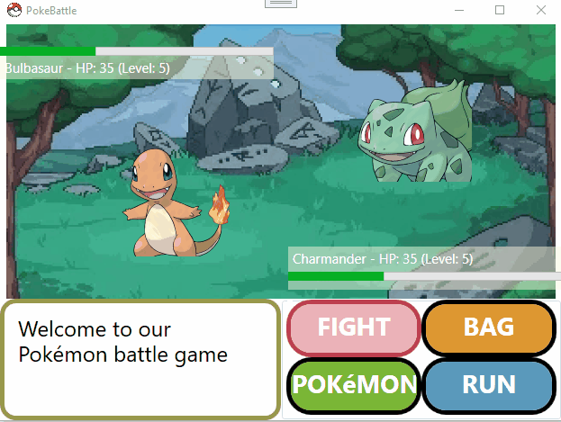
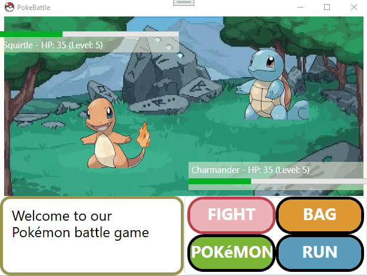

# PE1: PokeBattle (Semester 1 - Nov 2023)

## Intro

This C# WPF project was my first assignment using classes.

## Leaning objectives

- Working with classes
- Field and property encapsulation
- Learn to work with constructors, class instances, method overrides
- Keeping a clear and logic separation between class library and code behind

# Original assignment instructions (NL):

## Inleiding
Je krijgt van een opdrachtgever uit Japan de taak om een spel te maken van een tv-programma dat binnenkort wordt gelanceerd. Het tv-programma handelt over een personage dat allemaal fictieve dieren (Pokémon) verzamelt om ze te kunnen inzetten in een groot toernooi !

Iedere pokémon heeft een eigen HP, dat zijn gezondheid voorstelt. Dit is start altijd bij 35.

Anderzijds heeft iedere pokémon ook een level. Iedere pokémon start aan level 5. Als hij een andere pokémon verslaat, of als zijn hp hoger is dan 100 dan zal hij een level stijgen. Vanaf level 30 zal de pokémon evolueren. Om later aan de gebruiker een nieuwe game aan te kunnen smeren, wordt de functionaliteit van evolueren achterwege gelaten.

## Startsituatie en Technische vereisten
De UI werd reeds aangeleverd door onze Japanse vrienden. Ze zouden echter graag ook nog de logica kunnen hergebruiken voor een applicatie voor de Xbox zonder dat ze te veel dubbel werk hebben.

Maak dus gebruik van een aparte **Class Library** ! 

- Maak een aparte folder `Classes` aan waarin je je verschillende klassen zal aanmaken. 
- In de root van je class library, maak je een klasse `BattleService` aan.

Japanners zijn rare mannen en ze vereisten ook nog de volgende zaken in je applicatie:
  - Maak gebruik van minimum 2 readonly properties.
  - Maak gebruik van minimum 2 private setters.
  - Stel een aantal properties in via de constructor, maar ook enkele via de autoproperty-initializer.
  - Maak minimum 1 computed property aan.
  - Maak minimum 2 keer gebruik van de `override ToString()`-methode.
  - Zorg dat je eenmaal gebruik maakt van `constructor chaining`. **Let op!** Constructor chaining is voor deze applicatie niet voor de hand liggend. Je mag willekeurig een constructor met chaining toevoegen aan een klasse, zonder dat je deze aanroept.

**Zorg daarbij dat alle properties voldoende afgeschermd zijn volgens het gebruik in het spel. De codebehind mag geen zaken kunnen aanpassen die de speler ook niet kan aanpassen.**

## Spelinstellingen

Voor we beginnen met vechten nemen we even door hoe we de instellingen kunnen aanpassen. Dit kan je doen met behulp van de knoppen `Bag`, `Pokémon` en `Run`.

### Bag
In een `Listbox` plaats je 4 items die je kan toedienen aan je pokémon. Je mag zelf kiezen waar je deze `Listbox` plaatst in de UI.

Gebruik je creativiteit en verzin zelf 4 namen voor deze items. Indien je dubbel klikt op een item, wordt dit toegediend aan je pokémon. De pokémon zal dan respectievelijk 25, 50, 75 of 100 stijgen in HP. Indien de HP hoger is dan 100, dan wordt er 100 afgetrokken en moet de level met 1 worden verhoogd.

Je krijgt de vrijheid om zelf te kiezen hoe je dit implementeert, maar je moet wel gebruik maken van een **klasse** met **objecten**.  

**Ter info:** In de GIF-animatie zie je de uitwerking zoals voorzien in de uitbreiding. 

### Pokemon
Hierbij wordt je volgende pokémon getoond. Als je aan de laatste pokémon zit, wordt er teruggeschakeld naar de eerste pokémon. 

**Tip**: de bestandsnaam van een afbeelding is de naam van de pokémon in kleine letters + `.png`;

### Run
Hierbij wordt de applicatie afgesloten. 

## BattleService
 Hier zal je volgende de logica en gegevens steken:
- Een lijst van het type string die de 4 mogelijke pokémons bevat: `charmander, pikachu, bulbasaur, squirtle`. 
- De logica om 3 willekeurige pokémon aan te maken en toe te wijzen aan de speler, en 3 willekeurige pokémon aan te maken en toe te wijzen aan de computer. Let hier bij op dat mogelijke namen van pokémon automatisch worden geschreven met **hoofdletter**. Bijvoorbeeld: pikachu wordt Pikachu. De naam van een Pokémon mag in geen geval leeg zijn of minder lang zijn dan 2 letters. 
- De logica om 2 Pokémons met elkaar te laten vechten
- De logica om aan een Pokémon een item uit de `Bag` te geven.
- De logica om te veranderen van Pokémon. 
**Let op!** Enkel de speler-pokemon mag vanuit de codebehind kunnen worden veranderd. De pokémon van de computer enkel vanuit de `BattleService`-klasse.
- ...

## Let's fight !

Als je op de knop `Fight` drukt, dan begint het gevecht. Als speler zal jij eerst een aanval doen naar de pokémon van de computer. Daarbij wordt er een waarde tussen **10 en 50** afgetrokken van de **HP** van de pokémon van de computer. 

Indien de pokémon een waarde gelijk aan of kleiner dan 0 heeft (ongeacht de level) dan gaat hij dood. Hij wordt dan gewisseld door de volgende pokémon.

Daarna is het de beurt aan de pokémon van de computer om de speler-pokémon aan te vallen. Dit gebeurt volgens dezelfde regels als beschreven hierboven.

Na de aanval van de computer wordt er gewacht op de volgende actie van de speler (fight, pokémon, bag, run).

## Uitbreiding
- Als je op `Bag` klikt, open je een nieuw venster waarbij je kan kiezen uit de verschillende items. Als je dubbelklikt op een item,  wordt het venster afgesloten en het item toegediend aan de geselecteerde speler-pokémon. Maak hierbij gebruik van een Property om het geselecteerde item te weten te komen in je `MainWindow`!
- Zorg voor een duidelijke geanimeerde tekst zoals in het voorbeeld hierboven zodat de speler het gevoel heeft dat er daadwerkelijk een aanval gaande is.
- Als een pokémon dood is, mag het niet mogelijk zijn voor hem om aan te vallen of aangevallen te worden door een andere pokémon. 
- Controleer na iedere aanval of niet alle pokémon van de speler of de computer dood zijn. Indien dit het geval is, dan eindigt het spel en wordt de winnaar meegedeeld. Je kan enkel opnieuw spelen door de applicatie opnieuw op te starten.

## Gebruik van AI Tools
**Het gebruik van AI Tools wordt niet toegestaan!**

Er mag geen enkele AI tool (chatGPT, GitHub Copilot, ...) gebruikt worden voor deze opdracht.
Wanneer er twijfel over het ongeoorloofd gebruik van AI is, kan het lectorenteam je dan ook vragen om extra verduidelijking.
Het ongeoorloofd gebruik van AI leidt automatisch tot het opstarten van een fraudedossier volgens het onderwijs en examenreglement, wat kan leiden tot een nulscore op 1 of meer opleidingsonderdelen.
